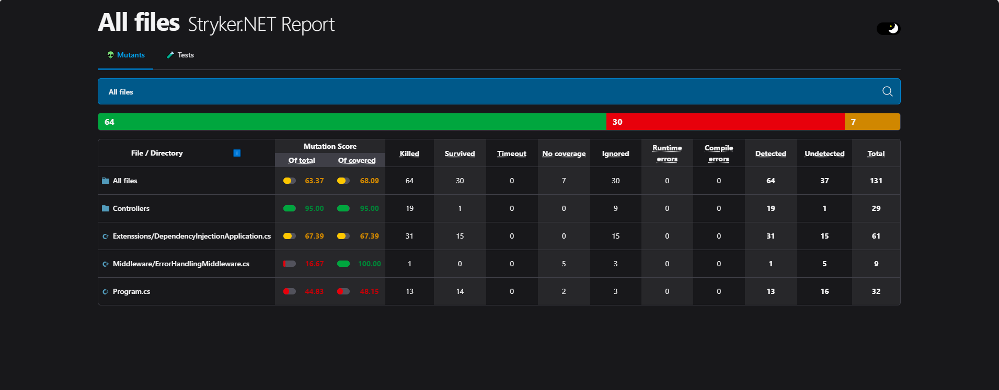
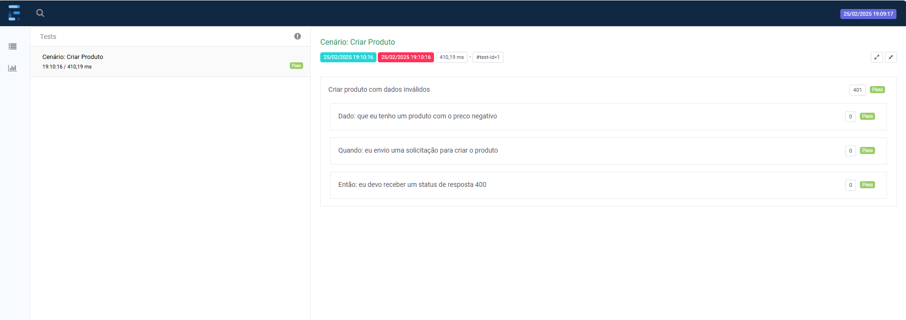
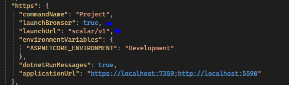
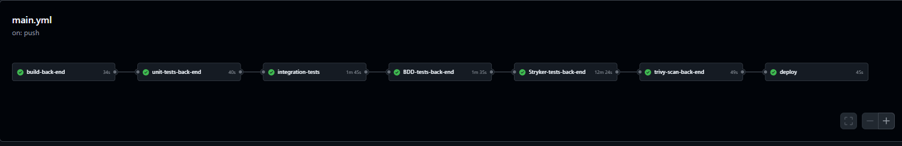

# WakeCommerce
# O que foi Pedido


Sumário da Documentação

- [Tecnologias](#fastapi-with-observability)
  - [Redis](#table-of-contents)
  - [.NET Aspire](#quick-start)
  - [Docker](#explore-with-grafana)
  - [Sql Server](#sql-server)

- [Arquitetura](#estrutura-do-projeto)
    - [CQRS](#fastapi-with-observability)
    - [Domain Events](#fastapi-with-observability)
    - [BDD](#fastapi-with-observability)
    - [AutoMapper](#fastapi-with-observability)
    - [EF Core](#fastapi-with-observability)
        - [Code First](#fastapi-with-observability)
- [Testes](#detail)
    - [Unit Tests](#traces-and-logs)
    - [Integration Tests](#fastapi-application)
    - [BDD Tests](#span-inject)
    - [Stryker Tests](#metrics)
    - [Security Tests](#metrics)
    - [Quality Tests](#metrics)
- [Deploy](#detail)
    - [Docker Hub](#opentelemetry-instrumentation)
- [Monitoramento](#detail)
    - [Prometheus](#prometheus---metrics)
    - [Grafana](#prometheus-config)
- [Logs](#detail)
    - [Serilog](#grafana-data-source)
        - [Console](#detail)
        - [File](#detail)
- [Kubernetes](#metrics)
    - [Redis](#metrics)
    - [Sql server](#metrics)
    - [App](#metrics)
- [Pontos de melhoria](#metrics)

### 1. Licença MIT
A licença MIT é recomendada para desafios técnicos devido à sua natureza curta e permissiva. Ela permite que qualquer pessoa use, modifique e redistribua o código sem muitas restrições. É uma escolha popular entre empresas e desenvolvedores, pois facilita a adoção e o uso livre da solução.

## Licença MIT:

Permite uso, modificação e redistribuição do código.
Ideal para projetos colaborativos e open source.


### 2. Funcionalidades e Tecnologias
## 2.1 Redis (Cache)
O Redis pode ser utilizado como um cache para melhorar o desempenho da aplicação, especialmente quando há necessidade de armazenar e recuperar dados rapidamente.

comando para instalar o manager
```bash
winget install qishibo.AnotherRedisDesktopManager
```

conectar no redis 


produto cadastrado no Redis 


Com o objetivo de melhorar a performance, sempre que um produto é registrado, ele é inserido no Redis utilizando duas chaves: uma para o nome e outra para o ID, que correspondem às duas formas de busca disponíveis.

## 2.2 .NET Aspire
Aspire para criar uma aplicação escalável e de alto desempenho utilizando o framework .NET, que oferece uma plataforma robusta para desenvolvimento.

### Configuração


### Painel


### Logs


### Rastreamento


### Metricas 


## 2.3 Docker Compose

Outra forma de inicializar nosso ambiente é utilizando o docker-compose,o Docker para contêinerizar a aplicação e facilitar o processo de implantação em diferentes ambientes.

nos testes do bdd utilizei o docker-compose para iniciar todo o ambiente antes de executar os testes.

para iniciar utilizando um docker-compose basta executar: 
```bash
    cd WakeCommerce
    docker-compose up
```

## 2.4 Security Tests

Implemente testes de segurança para garantir que a aplicação esteja protegida contra vulnerabilidades, utilizando ferramentas e práticas recomendadas para o contexto de segurança.

## 2.5 Unit Tests
Os testes unitários verificam o funcionamento isolado de pequenas partes do código, como métodos individuais de classes ou funções. O objetivo é garantir que cada unidade do sistema funcione conforme esperado, sem dependências externas.

### O que testar?
Métodos de regras de negócio
Validações de entrada
Serviços sem dependências externas
### Benefícios:
Execução rápida
Facilidade de manutenção
Rapidez na identificação de falhas

### Ferramentas utilizadas:
xUnit

FluentAssertions para asserções mais legíveis


## 2.6 Integration Tests
Os testes de integração validam a comunicação entre diferentes partes do sistema, como módulos, serviços e bancos de dados. Diferente dos testes unitários, eles verificam como os componentes interagem entre si.

### O que testar?
Integração entre serviços da aplicação
Comunicação com o banco de dados
Interação com APIs externas

### Benefícios:
Detecta problemas na integração entre módulos
Garante que os fluxos completos funcionem corretamente
Reduz falhas em ambiente de produção

### Ferramentas utilizadas:
NUnit
TestContainers (para rodar dependências isoladas, como Redis ou SQL Server)
WebApplicationFactory (para testar APIs no .NET)


## 2.7 Stryker Tests
O Stryker é uma ferramenta de Mutation Testing que avalia a eficácia dos testes existentes, criando variações sutis no código e verificando se os testes ainda conseguem detectar os erros.

### O que testar?
Cobertura real dos testes
Efetividade dos cenários de teste

### Benefícios:
Identifica lacunas nos testes
Garante que mudanças no código não passem despercebidas
Melhora a qualidade da suite de testes

### Ferramentas utilizadas:
Stryker.NET para .NET
Relatórios de cobertura para análise


### Exemplo: 


Neste cenário o Stryker identificou uma melhoria na qualidade dos testes.


Neste caso a alteração do código não foi identificada por nenhum teste.

## 2.8 Sonar Tests
Os testes do Sonar (SonarQube ou SonarCloud) analisam o código-fonte em busca de vulnerabilidades, duplicações e más práticas.


### O que testar?
Cobertura de código dos testes
Problemas de segurança e performance
Código duplicado ou complexidade excessiva

### Benefícios:
Identifica falhas antes de chegarem à produção
Melhora a qualidade do código
Ajuda a manter boas práticas de desenvolvimento

### Ferramentas utilizadas:
SonarQube

### Exemplo 
O SonarQube identificou que a senha do banco de dados está exposta. Isso é um alerta de segurança importante! 


## 2.9 Domain Events
Implementar Domain Events para permitir que ações específicas, como o armazenamento de dados em Redis, ocorram após eventos chave, como o cadastro de um produto. Essa abordagem garante a separação de responsabilidades e proporciona maior flexibilidade para extensões futuras, permitindo que novos comportamentos sejam adicionados facilmente sem impactar a lógica principal do sistema.

## 2.10 Monitoria (Logs e Performance)

Implemente monitoramento da aplicação, incluindo logs e métricas de performance, para garantir que a operação seja eficiente e qualquer problema seja rapidamente detectado.

## 2.11 BDD (Behavior-Driven Development)

Adote a prática de BDD para garantir que os requisitos de negócio sejam claramente definidos e compreendidos por todas as partes envolvidas no desenvolvimento.

## 2.12 OpenTelemetry

Utilize OpenTelemetry para coleta de métricas e rastreamento distribuído da aplicação, ajudando na visibilidade e monitoramento da saúde do sistema.

## 2.13 HealthChecks

Implemente HealthChecks para monitorar a saúde dos serviços e garantir que todos os componentes estejam funcionando corretamente.

## 2.14 Scalar

Com as atualizações do .NET, o Swagger deixou de ser adicionado por padrão às APIs. Para explorar outras opções de documentação e experimentação de endpoints, foi escolhida a ferramenta Scalar.

O Scalar oferece uma abordagem flexível e eficiente para visualizar e interagir com a API, permitindo uma experiência mais organizada e adaptável às necessidades do projeto. Essa escolha visa garantir uma documentação clara e acessível, facilitando o consumo da API por desenvolvedores e outras integrações.


## 3. Padrões e Arquitetura
## 3.1 Mediator
Use o padrão Mediator para facilitar a comunicação entre componentes e reduzir o acoplamento entre eles, garantindo uma maior flexibilidade.

## 3.2 CQRS (Command Query Responsibility Segregation)
Implemente o padrão CQRS para separar operações de leitura e escrita, melhorando a escalabilidade e a performance da aplicação.

## 3.3 Fluent Validator
Utilize FluentValidator para garantir que as regras de validação de dados sejam definidas de forma clara e fácil de entender.

## 3.4 Arquitetura Clean
Adote o padrão de Clean Architecture para separar as responsabilidades da aplicação, promovendo uma estrutura de código limpa e de fácil manutenção.

## 3.5 AutoMapper
Use o AutoMapper para manter a arquitetura limpa, automatizando a conversão de objetos de um tipo para outro e evitando duplicação de código.

## 3.6 .NET 9
Utilize o .NET 9 para garantir que a aplicação esteja atualizada com as últimas melhorias, recursos e correções de segurança oferecidos pela Microsoft.

## Estrutura do Projeto
A estrutura do projeto foi organizada conforme abaixo:

```csharp

/CarteiraInvestimento
|-- /src
|   |-- /APIService (Projeto de Api)
|   |   |-- ProdutoController.cs
|
|   |-- /AppHost (Projeto do .Net Aspire)
|   |   |-- program.cs
|
|   |-- /Domain (Projeto de Domínio)
|   |   |-- /Entities
|   |   |   |-- Produto.cs
|   |   |-- /Repositories
|   |   |   |-- IRedisRepository.cs
|   |   |   |-- IProdutoRepository.cs
|
|   |-- /Application (Projeto de Infraestrutura)
|   |   |-- /Commands
|   |   |   |-- /CommandsHandler
|   |   |-- /Events
|   |   |   |-- /EventsHandler
|   |   |-- /Queries
|   |   |   |-- /Request
|   |   |   |   |-- /GetProdutoByIdRequest
|   |   |   |   |-- /GetProdutoByNomeRequest
|   |   |   |   |-- /GetProdutoRequest
|   |   |   |-- /Response
|   |   |   |   |-- /ProdutoResponse
|   |   |   |-- /QueriesHandler
|   |   |   |   |-- /FindProdutoQueryHandler

|   |   |-- /Mappings
|   |   |   |-- /ProdutoProfile

|   |-- /Core (Projeto Core)
|   |   |-- /Mediator
|   |   |-- /Messages
|   |   |   |-- Command.cs
|   |   |   |-- Event.cs
|   |   |   |-- Message.cs
|   |   |   |-- /CommonMessages
|   |   |   |   |-- /Notifications
|   |   |   |   |   |-- /DomainNotification
|   |   |   |   |   |-- /DomainNotificationHandler

|   |-- /Infrastructure (Projeto de Infraestrutura)
|   |   |-- /Data
|   |   |   |-- WakeCommerceDbContext.cs
|   |   |   |
|   |   |-- /Repositories
|   |   |   |-- ProdutoRepository.cs
|   |   |   |-- RedisRepository.cs
|   |   |
|   |   |-- /Migrations
|   |   |   |-- AppDbContextModelSnapshot.cs
|   |   |   |-- Migration1.cs
|   |
|-- /tests (Projeto de Testes)
|   |-- /UnitTests
|   |-- /BDDTests
|   |-- /IntegrationTests
```

/Domain          → Regras de negócio e entidades
/Application     → Casos de uso, serviços e interfaces
/Infrastructure  → Implementação de persistência, API externas, etc.
/Commands        → Comandos que modificam o estado do sistema
/Queries         → Consultas que recuperam dados

### 5. Boas Práticas
## 5.1 Conventional Commits
Adote o padrão Conventional Commits para garantir mensagens de commit consistentes e claras. A estrutura é a seguinte:

```bash
<tipo>(<escopo opcional>): <mensagem curta>
[descrição opcional mais detalhada]
[referência opcional a issues]
```

Exemplos:

```bash
feat(auth): adicionar login com Google
fix(cart): corrigir erro ao remover item
docs(readme): atualizar instruções de instalação
test(user): adicionar testes para cadastro de usuário
perf: melhorias de performance
```

## 5.2 Configuração de CORS e API Documentation
A configuração de CORS é essencial para habilitar o Scalar como documentação da API. Isso envolve a configuração do Program.cs e do launchSettings.json.



## 5.3 Error Handling
Implemente um ErrorHandlingMiddleware para capturar e registrar erros da aplicação. Utilizamos Serilog para gerenciar os logs de erro.


## então todos os erros não tratados serão salvos em um txt


## 5.4 Padronização das Respostas da API
As respostas da API devem ser padronizadas, utilizando ProblemDetails para erros


E SuccessResponse para respostas bem-sucedidas.


# 6 Migrations com Entity Framework
Este projeto utiliza o Entity Framework Core (EF Core) com a abordagem Code First para gerenciamento de banco de dados. Com o Code First, a estrutura do banco de dados é gerada a partir do código C# das entidades, permitindo maior controle e flexibilidade durante o desenvolvimento.

## Como funciona?
No modelo Code First, definimos as entidades do banco de dados como classes C#. O EF Core cria a estrutura do banco de dados com base nas propriedades dessas classes. As migrações são usadas para atualizar o banco de dados à medida que o modelo de dados evolui.

Vantagens do Code First:
1. Controle total sobre o modelo: O desenvolvedor define as classes do modelo de dados e a estrutura do banco de dados diretamente no código.
2. Migrações automáticas: O EF Core pode gerar migrações para atualizar o banco de dados à medida que as classes mudam.
3. Facilidade de versionamento: As migrações permitem manter o controle das mudanças no esquema do banco de dados ao longo do tempo.

## Como adicionar novas migrações:
Para adicionar uma nova migração, use o seguinte comando no terminal:

```bash
dotnet ef migrations add Inicial --startup-project ../WakeCommerce.
ApiService --project ../WakeCommerce.Infrastructure
```

## Como atualizar o banco de dados:
Após adicionar uma migração, você pode atualizar o banco de dados com o comando

```bash
dotnet ef database update
```

## Pipeline CI/CD
No nosso pipeline, temos a ideia de garantir a qualidade, segurança e confiabilidade do código em cada etapa do processo de desenvolvimento. Para isso, seguimos um fluxo estruturado que inclui diversas camadas de testes e automação, assegurando que cada alteração no código seja validada antes de chegar à produção.

1. Testes Unitários: São executados para validar pequenas partes da 
aplicação isoladamente, garantindo que os componentes individuais funcionem conforme o esperado. Esses testes ajudam a detectar erros rapidamente e facilitam a manutenção do código.

2. Testes de Integração: Avaliam a interação entre diferentes módulos da aplicação, garantindo que os componentes funcionem corretamente em conjunto. Esses testes são essenciais para identificar problemas que podem surgir devido à comunicação entre serviços.

3. Testes de Segurança: Realizamos verificações para identificar vulnerabilidades, como exposição de credenciais, falhas de autenticação e potenciais brechas que possam comprometer a integridade dos dados. Ferramentas como SonarQube podem ser utilizadas para análise estática e detecção de riscos.

4. Testes com Stryker (Mutation Testing): Aplicamos testes de mutação para medir a eficácia da nossa suíte de testes, garantindo que os testes realmente identificam falhas no código e cobrem possíveis cenários de erro.

5. Deploy no Docker Hub: Após a validação de todas as etapas anteriores, a aplicação é empacotada em um contêiner Docker e publicada no Docker Hub. Isso permite que o serviço seja facilmente distribuído e implantado em diferentes ambientes com consistência e escalabilidade.



### imagem publica no docker hub 


## Deploy Kubernetes

Com a imagem Docker publicada em um repositório, torna-se possível implantá-la em diversos ambientes de forma rápida e consistente. Um dos principais benefícios desse processo é a portabilidade, garantindo que a aplicação funcione da mesma maneira independentemente do ambiente de execução.

Neste contexto, um exemplo prático de implantação pode ser feito utilizando Kubernetes, uma plataforma de orquestração de contêineres que automatiza o gerenciamento, escalonamento e implantação das aplicações. Com o Kubernetes, podemos definir a infraestrutura necessária por meio de arquivos de configuração (YAML), garantindo alta disponibilidade e resiliência para o serviço.


para executar basta ter algo como o kubernetes no docker desktop ou o minikube. 

1. Devemos subir o banco os bancos de dados
    1.1 para provisionar o redis execute o seguinte comando:
    ```bash
        cd redis 
        kubectl apply -f .
    ```
    1.2 para provisionar o sql server execute o seguinte comando:
    ```bash
        cd sqlserver  
        kubectl apply -f .
    ``` 
    1.3 para conferir se esta tudo certo, execute o seguinte comando:
    ```bash  
        kubectl get pods -n wakecommerce
    ``` 
    e deve apresentar o seguinte resultado 
    

2. Depois de conferir se as dependencias estão rodando podemos iniciar a aplicação 
    2.1
    ```bash
        kubectl apply -f .
    ```
    2.2 conferir novamente se todos pods estão rodando 
    
    2.3 e aqui podemos verificar que nossa API esta sendo exposta no localhost 
    ```bash
        kubectl get svc -n wakecommerce
    ```
    

# 7. Dependências e Ferramentas
Entity Framework Core para gerenciamento de banco de dados.
Serilog para logging.
Coverlet para cobertura de código.
Docker para contêinerização.
OpenTelemetry para rastreamento distribuído.
FluentValidator para validação de dados.